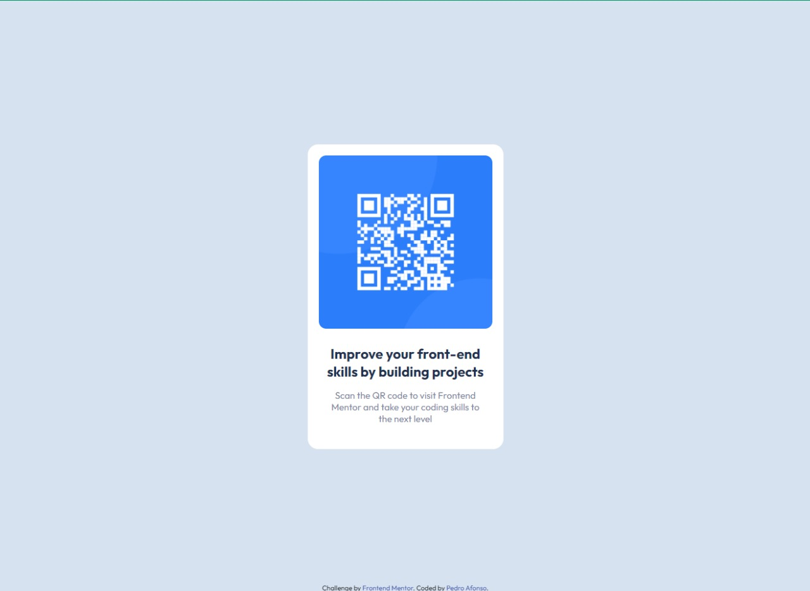
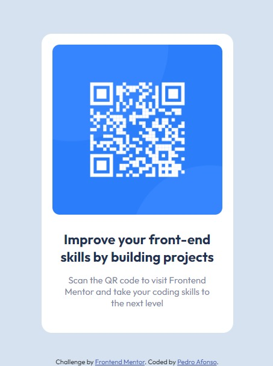

<header>
  <h1 align="center">Qr Code Component</h1>
  
 
    <strong>Just trainning...</strong> 
  

  
 
    <a href="#preview">Preview</a>
  

  

</header>
<main>

  

    <h3 align="center">👀 Preview</h3>
    
    

  

  
 🔥 Developed by Pedro Afonso 👋  <a href="https://www.linkedin.com/in/pedro-afonso3/">Check my LinkedIn

</main>
